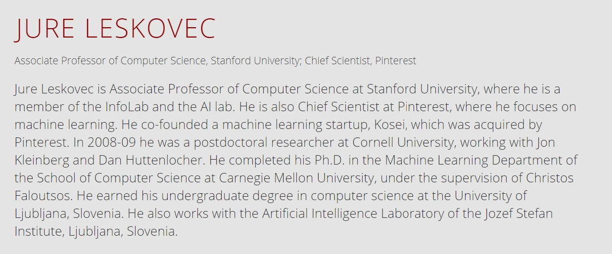
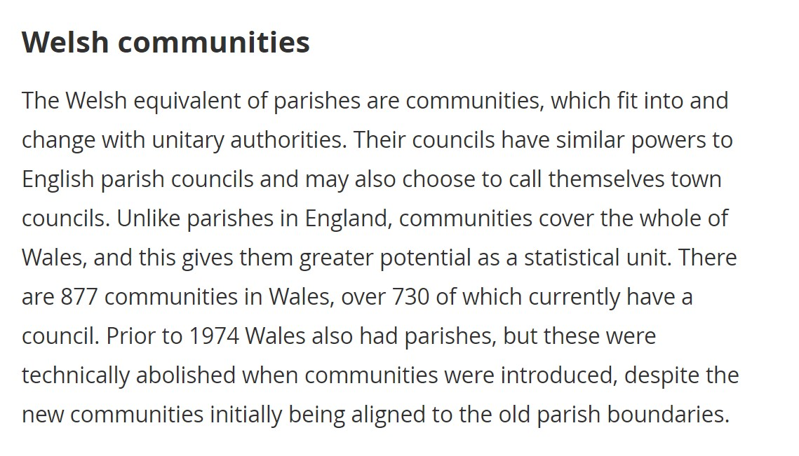
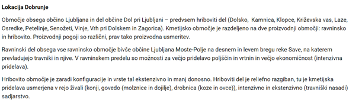
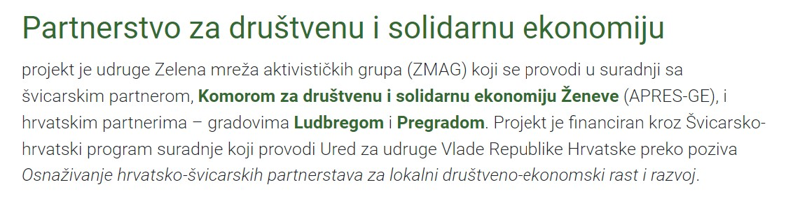

### English

(Source: <a href="https://www.zephyr.org/People/JURE-LESKOVEC">https://www.zephyr.org/People/JURE-LESKOVEC</a>)

(Source: <a href="https://www.ons.gov.uk/methodology/geography/ukgeographies/administrativegeography/wales">https://www.ons.gov.uk/methodology/geography/ukgeographies/administrativegeography/wales</a>

### Slovene

(Source: <a href="https://www.netfork-akademija.si/predavatelji/uros-zizek">https://www.netfork-akademija.si/predavatelji/uros-zizek</a>)

(Source: <a href="https://lj.kgzs.si/izpostava-lj-moste-polje">https://lj.kgzs.si/izpostava-lj-moste-polje</a>

### Croatian

(Source: <a href="https://www.zmag.hr/hr/projekti/partnerstvo-za-socijalnu-i-solidarnu-ekonomiju.html">https://www.zmag.hr/hr/projekti/partnerstvo-za-socijalnu-i-solidarnu-ekonomiju.html</a>)

(Source: <a href="https://nkc-tisno.hr/index.php/novosti/400-tisno-i-tisnjani-kroz-stoljeca">https://nkc-tisno.hr/index.php/novosti/400-tisno-i-tisnjani-kroz-stoljeca</a>
