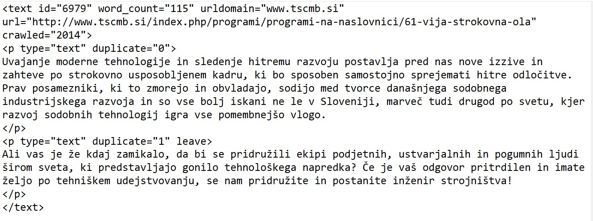

Link to the [main decision tree](main_decision_tree).
Link to the [try 2](GINCO-Genre-Annotation-Guidelines/_entity/main_decision_tree.md)
Link to the [try 3](_entity/main_decision_tree.md)

The purpose of this annotation task is to assign genre categories to a web corpus in order to determine their distribution in the corpus, and to allow the corpus’ users to create and analyze subcorpora limited to a particular genre. For this purpose, we will annotate genre categories which are recognizable by users of the corpus, and which are characterized by concrete features so that they should be predictable by a machine algorithm and that the manually annotated examples can be used for training a genre classifier.

## Table of contents
* [What is genre?](#what-is-genre)
* [Not Suitable Texts](#not-suitable-texts)
* [Categories](#categories)
* [General Instructions](#general-instructions)
* [Decision Tree](#decision-tree)
* [The Corpus](#corpus)

## What is genre?

For the purpose of this research, we define a (text) genre as “essentially a document type based on purpose, form and content” . For example, a document of the news/reporting genre informs the reader (purpose), it is typically divided into a headline and paragraphs (form), and it presents something that happened, is happening or will happen (content).

It should be noted that the content is not the same as topic of the text. For instance, a content of a recipe is “food preparation”, denoted by some common words, such as “Preparation”, “Serves”, “Ingredients”, etc., whereas the topic is the specific food/meal, mentioned in the text, e. g., “carrots”. A text on carrots is not necessarily a recipe – it could be an informative text on their nutritional benefits, an instruction on how to grow them, a legal text that regulates their production, a promotion of a food product based on carrots, a review of the product, etc. Therefore, the topic should not influence the choice of a genre.

## Not Suitable Texts

The text should be technically suitable for the needs of this research, otherwise it should be discarded. In order to be annotated, the text must adhere to the following criteria:
* it is written in Slovene language and with Slovene alphabet (there should not be any issues with the OCR – other characters, such as “Ä” where Slovene characters with diacritics (šumniki) should be)
* it is not a machine translation
* it contains sentences (with punctuation marks at the end)

Note that a text is discarded as a “machine translation” only if it is a translation of a poor quality (contains words that do not exist in Slovene language, wrong declensions of nouns, adjectives, adverbs and wrong conjugation of verbs, the text is incoherent, makes no sense). If you are unsure whether the text is a machine translation or written by a human, annotate it as if it were written by human.

## Categories

The categorization schema consists of 6 broad main categories (Information/Explanation, Legal/Regulation, Opinion/Argumentation, Promotion, Literature, Dialogue) and 16 subcategories:
* 7 subcategories of Information/Explanation: News/Reporting, Announcement, Research Article, FAQ, List of Summaries/Excerpts, Instruction, Recipe
* 1 subcategory of Opinion/Argumentation: Review
* 3 subcategories of Promotion: Invitation, Promotion of Services, Promotion of a Product
* 3 subcategories of Literature: Prose, Script/Drama, Lyrical
* 2 subcategories of Dialogue: Forum, Interview

In addition to this, the text could be marked as **Other** if it shows no recognizable features that are indicative of any category or if it seems to belong to a category that is not included in the schema.

As features of multiple genres can be intertwined in a text, **multiple labels** assigned to the same text are allowed. The secondary genre category should be the one which concrete features are less present in the text or which purpose can only be intuitively established. Please note that this applies to a single text in which the features of two genres are intertwined (e.g., an informational text which has some characteristics of a promotion as well), not to a text or multiple texts that consist of paragraphs of different genres (e. g., a document consisting of two texts: a review which is followed by a forum; a text that starts with some information on the benefits of ingredients (Information/Explanation) and continues as a recipe).

## General Instructions
* First, check whether there is a very recognizable form or content based on which you can quickly assign the genre. Reading the complete text is not necessary, just read a couple of sentences from the beginning, middle and the end of the text. That should give you enough information to ascertain the purpose and the most prevalent features of the text.
* After you have familiarized yourself with the genre schema and the annotation process, the annotation should be rather quick – if you cannot quickly identify a genre of the text, we assume that such text will not be very useful for the machine learning. So if you cannot quickly recognize any genre, discard the text as Other. If you are in doubt because it seems to be a mixture of genres, check which concrete features are more prevalent to assign the main genre and assign a secondary genre as well.
* If the quick genre categorization does not apply, use the decision tree to assign the genre. When in doubt, refer to the Description of categories and subcategories below, which includes the most prominent features and examples of each category. If you are certain of the genre, you can skip the decision tree and choose the category from the list.
* When assigning a genre, always prioritize concrete features of the text on which the classifier can be trained over your intuition regarding the purpose of the text (as the classifier cannot assign genres based on intuition). For instance, you feel that a text about wine is promotion, because you know it is located on a winemaker’s online shop and because there is a price tag next to it, but the text itself shows no concrete characteristics of promotion (no subjective adjectives, no addressing the reader, etc.). However, it has concrete features of information/explanation (objective adjectives, enumeration, explanation of a concept …). Therefore, you should annotate this example as Information/Explanation (and annotate Promotion as secondary genre).
* If you easily assign the genre of the text, there is no need to spend time thinking if a secondary category exists as well – this option is reserved for cases when you are considering two genres from the start. If the secondary annotation is based on intuition alone (no concrete features), please tick the box “intuition”.
* If you are not sure, do not hesitate to ask. If you refer to a particular text, include the document ID.
* Make breaks frequently. Trying to stay focused for a long time leads to mistakes.

## Decision Tree

To get familiar with the genres and the decision process that should be followed, start annotating using our [**decision tree**](Decision_Tree) <a href="Decision_Tree">here</a> or <a href="_genre_pages/Decision_Tree">here</a>.

By clicking on the genre category in the tree, you will be directed to a page which presents genre categories and subcategories by providing a short description, common features, and examples. The description and features of the main category apply to the subcategories as well. Common features have been identified in a preliminary study and are meant to direct the annotator towards the most probable genre, as it was noticed that most of the texts include at least one of the features that are common of their assigned genre. However, that does not mean that a text should include all of the features in order to be assigned a certain genre.

## The Corpus

The corpus we will annotate consists of texts separated in paragraphs. The text tag includes the ID of the text, word count (in number of words) and some additional information, and the p (paragraph) tag includes the information on whether this paragraph is duplicated in the corpus. Inside the text content a tag <boundary/> can appear as well, which separates a document into multiple texts that should be annotated separately.

When annotating, please take note of the following information inside the tags:
- id – when annotating always refer to the document by its ID
- word_count – if the word_count exceeds 5.000, skip the text (do not annotate it)
- duplicate = “1” – if the paragraph is a duplicate, ignore it – except if it is followed by a word “leave” (in preprocessing, all duplicated paragraphs that are not tagged as “leave” will be removed from the corpus)
- <boundary/> - this tag denotes a start of a new text. It is followed by a number with a hashtag inside (e. g. 31796#1). When this tag occurs, annotate the text that follows as a new text and use the number with the hashtag as its ID.

See an example of a text in the corpus:

